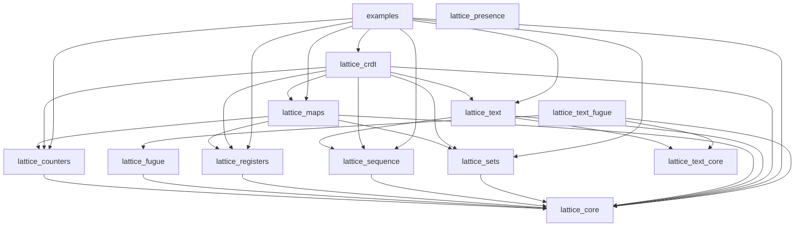

# Development Guide

This document provides detailed instructions for developing and contributing to this project.

## Prerequisites

Ensure you have the following installed:

| Tool | Version | Purpose |
|------|---------|---------|
| Erlang/OTP | 27.2.1+ | BEAM runtime |
| Gleam | 1.16.0+ | Compiler and tooling |
| just | 1.38.0+ | Task runner (thin delegation layer) |
| [trellis](https://github.com/tylerbutler/trellis) | 0.1.0 | Workspace CLI: task fan-out, changelog, versioning, publishing |

**Recommended:** Use [mise](https://mise.jdx.dev/) or [asdf](https://asdf-vm.com/) with the provided `.tool-versions` file.

```bash
# With mise
mise install

# With asdf
asdf install
```

## Getting Started

```bash
# Clone the repository
git clone <repo-url>
cd lattice

# Install dependencies for all packages
just deps

# Verify everything works
just ci
```

## Monorepo Structure

This project is a monorepo of independently-versioned Gleam packages managed
by [trellis](https://github.com/tylerbutler/trellis). Workspace membership is
declared once, in the `[tools.trellis]` table of the root `gleam.toml`;
everything else — the package list, dependency order, release wiring — is
derived from each package's `gleam.toml`.

```
lattice/                               # git repo root
├── packages/lattice_*/                # one directory per package
├── examples/                          # Runnable examples (member, never published)
├── gleam.toml                         # Workspace root: [tools.trellis] config
├── justfile                           # Thin recipes delegating to trellis
├── .changes/                          # Changelog fragments + version sections
└── .tool-versions                     # Tool version pinning
```

Run `trellis list` for the members in dependency order, and `trellis info
<package>` for one package's dependencies and dependents.

### Dependency graph

Generated with `trellis graph --format mermaid` (regenerate after adding a
package or path dependency):



Each package has its own `gleam.toml`, `src/`, and `test/` directories. Packages use **path dependencies** for local development (e.g., `lattice_core = { path = "../lattice_core" }`).

## Development Workflow

### Daily Development

```bash
# Type check all packages
just check

# Run all tests (Erlang target)
just test

# Test a single package
just test-pkg lattice_core

# Format code (do this before committing)
just format
```

### Before Committing

```bash
# Run full CI checks locally
just pr
```

### Changelog Entries

Changes are recorded as TOML fragments in `.changes/unreleased/`, written by
trellis's native changelog engine:

```bash
just change --package lattice_sets --kind Added --body "Add or_set.map"
# or directly:
trellis changelog new --package lattice_sets --kind Added --body "Add or_set.map"

# Preview the pending version bumps
just changelog-preview
```

Kinds and their semver bumps are configured under `[tools.trellis.changelog]`
in the root `gleam.toml` (Breaking → major, Added → minor, most others →
patch). `trellis doctor` validates every fragment on each PR.

## Code Style

### Formatting

This project uses Gleam's built-in formatter:

```bash
just format
```

### Error Handling

Always use Result types for fallible operations:

```gleam
pub fn parse(input: String) -> Result(Value, ParseError)
```

### Documentation

Document all public functions with `///` comments including `## Examples` sections.

## Testing

### Running Tests

```bash
# All packages, Erlang target
just test

# All packages, JavaScript target
just test-js

# Single package
just test-pkg lattice_counters

# Single test by name
cd packages/lattice_counters && gleam test -- --filter "test_name"
```

Tests use the `startest` framework with `startest/expect`. Property-based tests use `qcheck`.

## Delta-State CRDTs

Every leaf CRDT in this library exposes both a state-based and a delta-state mutator API.

### Convention

For every state-mutating operation `op` of type `T -> args -> T`, there is a companion `op_with_delta` of type `T -> args -> #(T, T)`. The first element of the returned tuple is the new state (identical to what `op` returns); the second element is a **delta** — itself a value of type `T` containing only the change.

```gleam
// State-based (existing): full state in, full state out
pub fn increment(counter: GCounter, n: Int) -> GCounter

// Delta-state: same call returns the new state plus a small delta
pub fn increment_with_delta(counter: GCounter, n: Int) -> #(GCounter, GCounter)
```

The state-based mutators are unchanged: they delegate to the delta-aware version and discard the delta. No call sites need to change.

### Merge contract

A delta is a value of the same type as the state, so it is merged into a remote replica using the **existing `merge` function** — there is no separate "apply delta" code path:

```gleam
let #(local_new, delta) = g_counter.increment_with_delta(local, 5)
let remote_new = g_counter.merge(remote, delta)
// remote_new is equivalent to merge(remote, local_new)
```

Delta merge is **idempotent, commutative, and associative**, just like full-state merge. This is what makes deltas safe over unreliable transports (websockets with reconnects, at-least-once delivery, out-of-order arrival).

### Why this matters

State-based replication ships the full CRDT on every sync, which is wasteful — a small change to a large ORMap broadcasts the entire map. Delta-state CRDTs (Almeida, Shoker, Baquero — *Delta State Replicated Data Types*) ship only the change, while preserving the same convergence guarantees.

### Composite types

`ORMap` composes the delta APIs of its key-set (`ORSet`) and value CRDTs to produce an `ORMapDelta` that carries only touched keys. `apply_delta(map, delta)` performs the merge:

```gleam
let assert Ok(#(local_new, delta)) = or_map.update_with_delta(local, "score", inc)
let assert Ok(remote_new) = or_map.apply_delta(remote, delta)
```

### Operationalizing over websockets

The delta API is the foundation for websocket replication. Each local mutation produces a delta to broadcast on the socket; receivers `apply_delta` (or `merge`) the delta into their state. Because delta merge is idempotent and commutative, at-least-once delivery is sufficient — there is no need for exactly-once causal broadcast as op-based CRDTs require.

A complete websocket layer additionally needs:

- A **per-peer outbox** of unmerged deltas (so `merge_deltas` can batch them into a single message before sending)
- An **ack protocol** (so acknowledged deltas can be garbage-collected)
- **Reconnect catch-up** via the join of all unacked deltas for the peer

These transport concerns are intentionally **not** part of the CRDT library. They sit on top of the per-CRDT delta primitives documented here and may be added as a separate package in the future.

## Commit Messages

This project uses [Conventional Commits](https://www.conventionalcommits.org/):

```
<type>(<scope>): <description>
```

Types: `feat`, `fix`, `docs`, `style`, `refactor`, `perf`, `test`, `build`, `ci`, `chore`

## Publishing

Packages are published to Hex.pm independently, in dependency order, using a
tags-after-publish flow — tags record what shipped rather than triggering it:

1. Developer adds changelog fragments with `just change` / `trellis changelog new`
2. On merge to main, `release.yml` runs `trellis release pr`, which batches
   unreleased fragments into per-package version bumps (gleam.toml,
   CHANGELOG.md, and lockfile patches — zero Hex calls) on the
   `release/pending` branch and opens/updates the release PR
3. Merging the release PR triggers `release-publish.yml`, which:
   - Runs `trellis publish --all-untagged` — for each unpublished version, in
     dependency order: Hex idempotency check, validation (format/build/test),
     path-dep rewrite to Hex version ranges computed from the graph, publish
     with retry/backoff, restore
   - Runs `trellis tag create --push --github-release` to create per-package
     tags (e.g., `lattice_core-v1.1.0`) and GitHub Releases
   - Refreshes `manifest.toml` lockfiles for the published packages and opens
     a follow-up PR

Publishing is idempotent (already-published versions are skipped), so a
partially failed release can be retried via the workflow's manual dispatch.

### Workspace Configuration

The `[tools.trellis]` table in the root `gleam.toml` defines workspace
membership (`members` globs) and release config. Nothing else is declared:
package lists, dependency order, and path-dep rewrite maps are all derived
from `packages/*/gleam.toml`. `trellis doctor` (run in CI) validates the
invariants that can't be derived.

## Troubleshooting

```bash
# Clean all build artifacts
just clean

# Rebuild from scratch
just deps && just build

# Run a specific test
cd packages/<pkg> && gleam test -- --filter "test_name"
```

## Getting Help

- Check the [Gleam documentation](https://gleam.run/documentation/)
- Join the [Gleam Discord](https://discord.gg/Fm8Pwmy)
- Open an issue on GitHub
