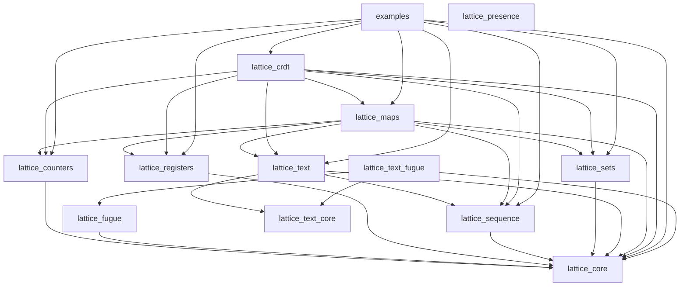

# Development Guide

This document provides detailed instructions for developing and contributing to this project.

## Prerequisites

Ensure you have the following installed:

| Tool | Version | Purpose |
|------|---------|---------|
| Erlang/OTP | 28.5.0.5 | BEAM runtime |
| Gleam | 1.16.0+ | Compiler and tooling |
| just | 1.38.0+ | Task runner (thin delegation layer) |
| [trellis](https://github.com/tylerbutler/trellis) | 0.1.0 | Workspace CLI: task fan-out, changelog, versioning, publishing |
| [licence_audit](https://licence-audit.tylerbutler.com) | 0.8.0 | Dependency licence policy enforcement |

**Recommended:** Use [mise](https://mise.jdx.dev/) — `mise install` installs
everything above (including trellis and licence_audit via the `github:` backend in
`.mise.toml`). CI uses the same files through `jdx/mise-action`, so local and
CI toolchains can't drift.

```bash
mise install
```

## Getting Started

```bash
# Clone the repository
git clone <repo-url>
cd lattice

# Install dependencies for all packages
just deps

# Verify everything works
just ci
```

## Monorepo Structure

This project is a monorepo of independently-versioned Gleam packages managed
by [trellis](https://github.com/tylerbutler/trellis). Workspace membership is
declared once, in the `[tools.trellis]` table of the root `gleam.toml`;
everything else — the package list, dependency order, release wiring — is
derived from each package's `gleam.toml`.

```
lattice/                               # git repo root
├── packages/lattice_*/                # one directory per package
├── examples/                          # Runnable examples (member, never published)
├── gleam.toml                         # Workspace root: [tools.trellis] config
├── justfile                           # Thin recipes delegating to trellis
├── .changes/                          # Changelog fragments + version sections
└── .tool-versions                     # Tool version pinning
```

Run `trellis list` for the members in dependency order, and `trellis info
<package>` for one package's dependencies and dependents.

### Dependency graph

Generated with `trellis graph --format mermaid` (regenerate after adding a
package or path dependency):



Each package has its own `gleam.toml`, `src/`, and `test/` directories. Packages use **path dependencies** for local development (e.g., `lattice_core = { path = "../lattice_core" }`).

## Development Workflow

### Daily Development

```bash
# Type check all packages
just check

# Run all tests (Erlang target)
just test

# Test a single package
just test-pkg lattice_core

# Format code (do this before committing)
just format
```

### Before Committing

```bash
# Run full CI checks locally
just pr
```

### Changelog Entries

Changes are recorded as TOML fragments in `.changes/unreleased/`, written by
trellis's native changelog engine:

```bash
just change --package lattice_sets --kind Added --body "Add or_set.map"
# or directly:
trellis changelog new --package lattice_sets --kind Added --body "Add or_set.map"

# Preview the pending version bumps
just changelog-preview
```

Kinds and their semver bumps are configured under `[tools.trellis.changelog]`
in the root `gleam.toml` (Breaking → major, Added → minor, most others →
patch). `trellis doctor` validates every fragment on each PR.

## Code Style

### Formatting

This project uses Gleam's built-in formatter:

```bash
just format
```

### Error Handling

Always use Result types for fallible operations:

```gleam
pub fn parse(input: String) -> Result(Value, ParseError)
```

### Documentation

Document all public functions with `///` comments including `## Examples` sections.

## Testing

### Running Tests

```bash
# All packages, Erlang target
just test

# All packages, JavaScript target
just test-js

# Single package
just test-pkg lattice_counters

# Single test by name
cd packages/lattice_counters && gleam test -- --test-name-filter="test_name"
```

Tests use the `startest` framework with `startest/expect`. Property-based tests use `qcheck`.

## Delta-State CRDTs

Leaf CRDTs expose state-based and delta-state mutators. Composite dispatch
uses `CrdtDelta(a)` to distinguish a leaf state delta from an ORMap delta.

### Convention

State-mutating operations have an `op_with_delta` companion. Infallible
operations return a state or `#(state, delta)`. Fallible operations return
`Result(state, error)` or `Result(#(state, delta), error)`. The delta is a
value of the same CRDT type containing only the change.

```gleam
// State-based: reject negative amounts with IncrementError
pub fn increment(counter: GCounter, n: Int) -> Result(GCounter, IncrementError)

// Delta-state: same call returns the new state plus a small delta
pub fn increment_with_delta(counter: GCounter, n: Int)
  -> Result(#(GCounter, GCounter), IncrementError)
```

State-only mutators delegate to the delta-aware version, discard the successful
delta, and preserve errors. Counter, sequence, and text APIs use plain names
for Result-returning operations; the former panicking wrappers are removed.

### Merge contract

A delta is a value of the same type as the state, so it is merged into a remote replica using the **existing `merge` function** — there is no separate "apply delta" code path:

```gleam
let assert Ok(#(local_new, delta)) = g_counter.increment_with_delta(local, 5)
let remote_new = g_counter.merge(remote, delta)
// remote_new is equivalent to merge(remote, local_new)
```

Delta merge is **idempotent, commutative, and associative**, like full-state
merge. Sparse synchronization still requires a baseline or eventual delivery
of the required deltas. A later Sequence edit alone does not contain all
earlier items. A receiver can show an incomplete view until missing origins
arrive; the transport must retain that history or supply a snapshot.

Both sequence backends and their text wrappers require explicit output identity:

```gleam
let assert Ok(#(local_new, delta)) = sequence.insert_with_delta(local, 0, value)
let remote_new = sequence.merge(remote, delta, remote_id)
```

The same identity must be supplied when comparing merge laws. Swapping the two
operands does not change the output identity. `merge_as` is a safe alias with the
same three arguments. Supply the receiving editor's ID for both full states and
deltas; do not adopt the sender's identity when restoring a remote snapshot.

### Why this matters

State-based replication ships the full CRDT on every sync, which is wasteful — a small change to a large ORMap broadcasts the entire map. Delta-state CRDTs (Almeida, Shoker, Baquero — *Delta State Replicated Data Types*) ship only the change, while preserving the same convergence guarantees.

### Composite types

`ORMap(a)` combines generation-qualified key membership with child CRDTs.
`ORMapDelta(a)` carries touched keys and their generations.
`CrdtDelta(a)` distinguishes `NoChange`, leaf/full-state `StateDelta`, and
recursive `OrMapChange` values.

The full-value `update_with_delta` callback returns a complete per-key
value. Use the sparse delta callback API for large Text or Sequence values:
perform the leaf's `*_with_delta` operation and return its delta, not its
updated full state. The map applies the callback's delta to compute the
local result and packages the same change for receivers. Nested ORMaps
retain their child `ORMapDelta` instead of converting it into a snapshot.

```gleam
let assert Ok(#(local_new, delta)) = or_map.update_with_delta(local, "score", inc)
let assert Ok(remote_new) = or_map.apply_delta(remote, delta)
```

Both maps have one recursive `CrdtSpec(a)`. Parameterized leaves share `a`;
Text remains grapheme-based. A `LwwRegisterSpec(initial_value)` supplies the
default for absent entries. Schema mismatches and callback failures return
errors without activating a key.

### Map removal and local identity

Removing a key retracts observed membership tags. A concurrent update
within the same generation remains add-wins. Re-adding a removed key
starts a fresh generation and fresh editing namespace. A newer generation
replaces older content, even if an old-generation edit races with the reset.
Concurrent re-adds use a deterministic generation-clock/replica order.

Generation floors remain after pruning so delayed old messages cannot
reactivate a superseded value. Keep the current generation's inactive leaf
history until a newer generation replaces it. An outer key clock does not
describe inner Sequence/Text operations: never derive child compaction or
forwarding expiry from map pruning.

Bind received state to the local writer before further edits, including
incoming-only keys and nested maps. Preserve historical item IDs and LWW
write authors. A snapshot's sender identity does not authorize a new
independent writer to reuse it.

LWWMap stores recursive CRDT children but chooses one complete assignment.
Its timestamp/writer ordering does not merge competing Text edits. Use an
ORMap-only path to a leaf when concurrent child edits and sparse leaf
deltas are required.

### Map protocol migration

Map snapshots and deltas carry recursive schemas and generation or write
metadata. Import legacy maps as an agreed baseline and distribute the
modern snapshot before enabling the new writers. Old flat states cannot
recover previously pruned allocation history; use a fresh writer identity
where that history is unavailable. Do not mix legacy map deltas with
modern reset semantics.

Generic leaf codecs accept caller-supplied encoders/decoders. Existing
String codec entry points retain their formats. Text dispatch adds a
distinct envelope around the standalone Text codec's Sequence payload.

### Operationalizing over websockets

Each local mutation produces a delta to broadcast; receivers apply or
merge it into their state. At-least-once delivery handles duplicates, but
the transport must supply the baseline and required prior deltas. A lost
dependency needs replay or a snapshot, not a later unrelated delta.

A complete websocket layer additionally needs:

- A **per-peer outbox** of unmerged deltas (so `merge_deltas` can batch them into a single message before sending)
- An **ack protocol** (so acknowledged deltas can be garbage-collected)
- **Reconnect catch-up** via the join of all unacked deltas for the peer

These transport concerns are intentionally **not** part of the CRDT library. They sit on top of the per-CRDT delta primitives documented here and may be added as a separate package in the future.

## Commit Messages

This project uses [Conventional Commits](https://www.conventionalcommits.org/):

```
<type>(<scope>): <description>
```

Types: `feat`, `fix`, `docs`, `style`, `refactor`, `perf`, `test`, `build`, `ci`, `chore`

## Publishing

Packages are published to Hex.pm independently, in dependency order, using a
tags-after-publish flow — tags record what shipped rather than triggering it:

1. Developer adds changelog fragments with `just change` / `trellis changelog new`
2. On merge to main, `release.yml` runs `trellis release pr`, which batches
   unreleased fragments into per-package version bumps (gleam.toml,
   CHANGELOG.md, and lockfile patches — zero Hex calls) on the
   `release/pending` branch and opens/updates the release PR
3. Merging the release PR triggers `release-publish.yml`, which:
   - Runs `trellis publish --all-untagged` — for each unpublished version, in
     dependency order: Hex idempotency check, validation (format/build/test),
     path-dep rewrite to Hex version ranges computed from the graph, publish
     with retry/backoff, restore
   - Runs `trellis tag create --push --github-release` to create per-package
     tags (e.g., `lattice_core-v1.1.0`) and GitHub Releases
   - Refreshes `manifest.toml` lockfiles for the published packages and opens
     a follow-up PR

Publishing is idempotent (already-published versions are skipped), so a
partially failed release can be retried via the workflow's manual dispatch.

### Workspace Configuration

The `[tools.trellis]` table in the root `gleam.toml` defines workspace
membership (`members` globs) and release config. Nothing else is declared:
package lists, dependency order, and path-dep rewrite maps are all derived
from `packages/*/gleam.toml`. `trellis doctor` (run in CI) validates the
invariants that can't be derived.

## Troubleshooting

```bash
# Clean all build artifacts
just clean

# Rebuild from scratch
just deps && just build

# Run a specific test
cd packages/<pkg> && gleam test -- --test-name-filter="test_name"
```

## Getting Help

- Check the [Gleam documentation](https://gleam.run/documentation/)
- Join the [Gleam Discord](https://discord.gg/Fm8Pwmy)
- Open an issue on GitHub
