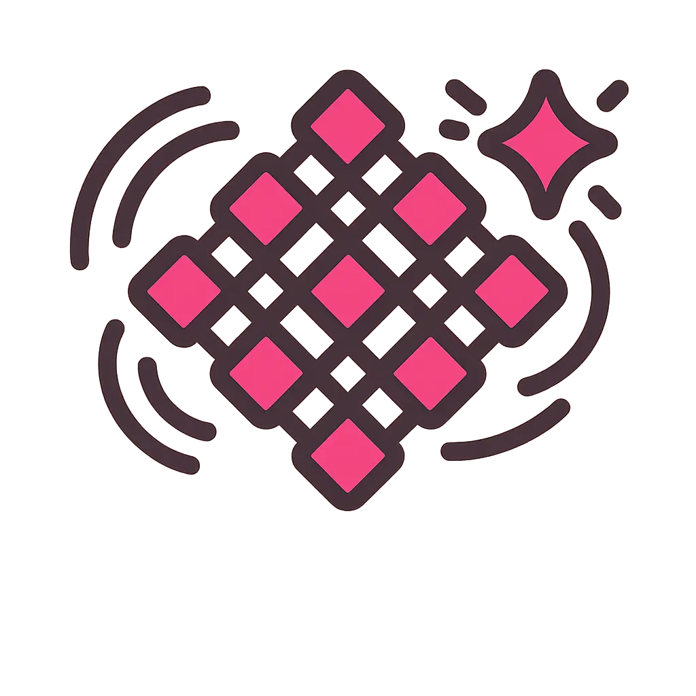

<p align="center">
  
</p>

<h1 align="center">LATTICE</h1>

<p align="center">
  <a href="https://hex.pm/packages/lattice_crdt"></a>
  <a href="https://hexdocs.pm/lattice_crdt/"></a>
</p>

Conflict-free replicated data types (CRDTs) for Gleam. Battle-tested with property-based tests, targeting both Erlang and JavaScript runtimes.

## Installation

Install the umbrella package to get all CRDT types:

```sh
gleam add lattice_crdt
```

Or install individual packages for minimal dependencies:

```sh
gleam add lattice_counters   # GCounter, PNCounter
gleam add lattice_sets       # GSet, TwoPSet, ORSet
gleam add lattice_registers  # LWWRegister, MVRegister
gleam add lattice_maps       # LWWMap, ORMap, Crdt dispatch
gleam add lattice_core       # VersionVector, DotContext
```

## Quickstart

```gleam
import lattice_counters/g_counter

pub fn main() {
  let counter_a =
    g_counter.new("node-a")
    |> g_counter.increment(1)

  let counter_b =
    g_counter.new("node-b")
    |> g_counter.increment(3)

  let merged = g_counter.merge(counter_a, counter_b)

  g_counter.value(merged)
  // -> 4
}
```

`g_counter.increment` only accepts non-negative deltas. If you need both
increments and decrements, use `lattice_counters/pn_counter`; its `increment` and
`decrement` operations also require non-negative deltas.

## Packages

### lattice_counters

| Module | Description |
|--------|-------------|
| `lattice_counters/g_counter` | GCounter — grow-only counter |
| `lattice_counters/pn_counter` | PNCounter — positive-negative counter |

### lattice_registers

| Module | Description |
|--------|-------------|
| `lattice_registers/lww_register` | LWWRegister — last-writer-wins register |
| `lattice_registers/mv_register` | MVRegister — multi-value register |

### lattice_sets

| Module | Description |
|--------|-------------|
| `lattice_sets/g_set` | GSet — grow-only set |
| `lattice_sets/two_p_set` | TwoPSet — two-phase set with add/remove-once |
| `lattice_sets/or_set` | ORSet — observed-remove set |

### lattice_maps

| Module | Description |
|--------|-------------|
| `lattice_maps/lww_map` | LWWMap — last-writer-wins map |
| `lattice_maps/or_map` | ORMap — observed-remove map |
| `lattice_maps/crdt` | Crdt — tagged union for heterogeneous ORMap values |

### lattice_core

| Module | Description |
|--------|-------------|
| `lattice_core/version_vector` | VersionVector — logical clocks for causality tracking |
| `lattice_core/dot_context` | DotContext — causal context for OR-types |

## Migrating from v1

### Import path changes

All import paths have changed from `lattice/` to package-specific paths:

```gleam
// Before (v1)
import lattice/g_counter
import lattice/or_set

// After (v2)
import lattice_counters/g_counter
import lattice_sets/or_set
```

### API changes

- **All types are opaque.** You can no longer pattern-match on CRDT type constructors. Use the public API functions (`value`, `get`, `keys`, etc.) instead.
- **`lww_register.new`** now takes a third argument `replica_id: String` for commutative merge on equal timestamps.
- **JSON format:** v2 adds `replica_id` to LWWRegister JSON. `from_json` accepts both v1 and v2 formats.

See the [full import mapping](#packages) above.

## Features

- Property-based tested merge semantics (commutativity, associativity, idempotency)
- Erlang and JavaScript target support
- JSON serialization for all types with backward-compatible deserialization
- All types are opaque for safe API evolution
- Independent versioning — update only the packages you need
- Comprehensive documentation with examples

## Documentation

Full API documentation is available at <https://hexdocs.pm/lattice_crdt>.

## License

MIT — see [LICENSE](LICENSE) for details.
