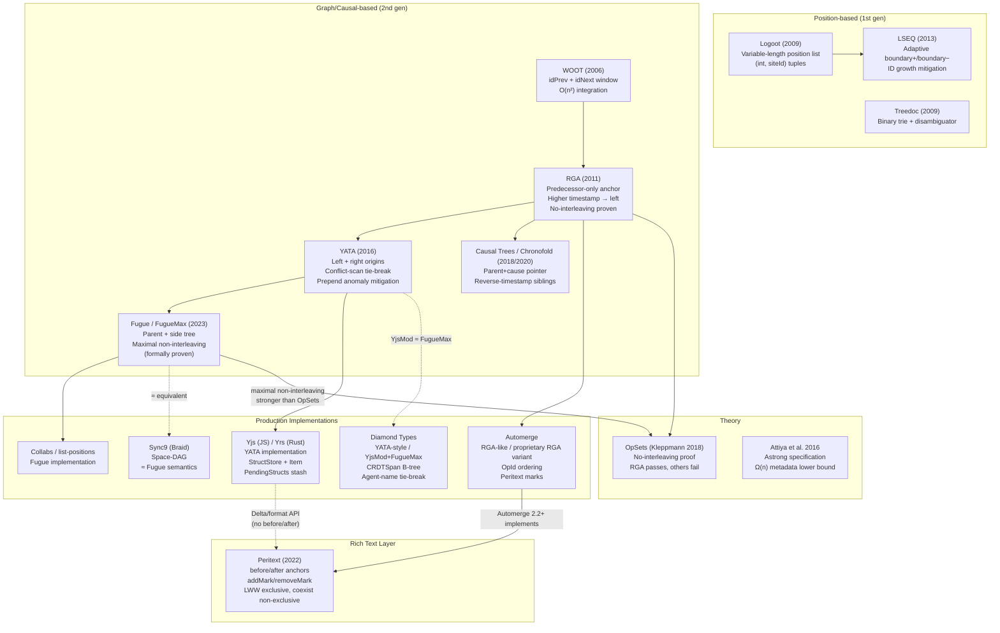

# CRDTs for Text: Character-Level Merge Semantics

> **Research Report** | Generated 2026-05-09 | Session 18a4cb07

---

## Executive Summary

Conflict-free Replicated Data Types (CRDTs) for collaborative text editing model a document as a sequence of characters (or spans) whose concurrent insertions and deletions must converge deterministically on all replicas without coordination. Every mainstream algorithm assigns each character a stable, globally unique identity and anchors new insertions relative to existing identities rather than mutable indices; deletes are almost universally handled as tombstones (soft deletes that preserve identity for future reference resolution). The field has evolved through two generations: early position-based approaches (Logoot, LSEQ, Treedoc) that encode ordering information in identifier structures and suffer from interleaving anomalies, and newer graph/tree approaches (RGA, YATA, Causal Trees, Fugue) that exploit causal relationships to provide provably superior interleaving behaviour. Production systems — Yjs/Yrs, Automerge, Diamond Types, and Collabs — all implement variants of the second generation, with Peritext layering rich-text mark semantics on top of any compliant plain-text base CRDT.

---

## Query Classification and Assumptions

**Query type:** Deep technical survey — algorithm design, semantics, and production implementations.

**Scope assumed:**
- "Character-level" means the atomic unit of the sequence CRDT is a single Unicode scalar (or a short run/span treated atomically for performance).
- "Merge semantics" covers: (a) how concurrent inserts at the same logical position are ordered, (b) how deletes interact with concurrent inserts around the deleted character, and (c) how the resulting sequence is deterministically reconstructed on all replicas.
- Rich-text formatting (bold, links, comments) is included as an extension layer (Peritext model).
- Operation-based (op-based) CRDTs are the focus; state-based (LOGOOT-style) variants are noted where relevant.

**Out of scope:** OT (Operational Transformation) algorithms; CRDT map/register semantics except as used internally; network transport and persistence layers.

---

## Core Model: Character-Level Text CRDT Semantics

### Invariants shared by all major algorithms

1. **Stable identity.** Every inserted character receives a globally unique, immutable identifier (typically `(siteId, logicalClock)` or a Lamport timestamp). This identity is preserved even after the character is deleted.

2. **Positional anchoring.** An insert operation does not say "insert at index 5." It says "insert after character *p* (and optionally before character *q*)." Because *p* and *q* have stable identities, this anchor remains meaningful even when concurrent operations shift index positions.

3. **Tombstone deletes.** A delete operation marks a character invisible (`visible = false`, or records a `deleted_by` set), but does not remove its identity from the sequence. Future inserts that anchor to that character still resolve correctly.

4. **Total order reconstruction.** The sequence CRDT defines a deterministic rule — specific to each algorithm — for producing a total order over all characters (visible and tombstoned) on every replica, regardless of operation delivery order.

5. **Causal delivery (most algorithms).** Many algorithms require that if operation B causally depends on A, then A must be integrated before B. Logoot/LSEQ are exceptions that do not require causal delivery.

6. **Metadata lower bound.** Attiya et al. (2016) prove that any strongly consistent list CRDT satisfying the *Astrong* specification must store Ω(n) metadata per character where n is the number of active characters.[^attiya]

### The interleaving problem

When Alice types "mom" and Bob types "dad" concurrently after the same anchor character, a naive per-character algorithm may interleave the sequences (e.g., "mdoamd") because each character is independently positioned. Kleppmann's OpSets paper[^opsets] formalises a *no-interleaving* property and proves that while RGA satisfies it, several published algorithms (including some versions of Logoot and WOOT) do not. Fugue/FugueMax strengthens this to *maximal non-interleaving*, offering the strongest formal guarantee.[^fugue]

---

## Algorithm Families

| Algorithm | Year | ID Structure | Insert Anchor | Delete Strategy | Causal Delivery | Interleaving | Key Limitation |
|---|---|---|---|---|---|---|---|
| **WOOT** | 2006 | `(siteId, seqNo)` | `idPrev` + `idNext` (window) | Tombstone (`visible=false`) | Required | Possible (per Kleppmann) | O(n²) integration; tombstone bloat |
| **Treedoc** | 2009 | Binary trie path + disambiguator | Parent trie node | Tombstone or physical (with GC coordination) | Required | Possible | Path growth; GC requires coordination |
| **Logoot** | 2009 | Variable-length list of `(int, siteId)` pairs | Position generated between predecessor/successor | Position removal (can delete by value) | Not required | Yes — per-char positions independent | Position growth; interleaving |
| **LSEQ** | 2013 | Adaptive tree/byte identifiers (boundary+/boundary−) | Generated between predecessor/successor | As Logoot | Not required | Yes (reduced but not eliminated) | Still interleaves; ID growth |
| **RGA** | 2011 | Lamport timestamp / S4Vector `(sum,siteId,sum2,siteId2)` | Predecessor only (`s4`) | Tombstone | Required | No (proven by OpSets)[^opsets] | Prepend anomaly; tombstones |
| **YATA / Yjs / Yrs** | 2016 | `(clientId, clock)` | Left origin + right origin | Tombstone | Stashing for out-of-order | Mostly avoided (rightOrigin helps prepend) | Tombstones; interleaving in some edge cases |
| **Causal Trees / Chronofold** | 2018/2020 | `(siteId, timestamp)` dot | Parent ("cause") pointer + reverse-timestamp sibling order | Delete atom / tombstone | Implicit via causal structure | Same-author chains contiguous | Complex GC; implementation complexity |
| **Fugue / FugueMax** | 2023 | `(siteId, counter)` | Parent + side (left/right child in tree) | Tombstone | Implicit | Maximal non-interleaving (proven)[^fugue] | Newer; fewer production deployments |
| **Automerge** (current) | ongoing | `OpId(u32, u32)` | Predecessor key in sequence (`key` field) | Tombstone (successors set) | Required | RGA-like (higher OpId goes left among concurrent inserts at same predecessor) | Proprietary RGA variant; tombstones |
| **Diamond Types** | ongoing | `DTRange` (agent + seq range) | `origin_left` + `origin_right` (YATA-style) | `current_state` / `end_state_ever_deleted` flags | Stashing | YATA/FugueMax equivalent (comment: "YjsMod / FugueMax … identical merge behavior")[^dt-comment] | Experimental; B-tree complexity |
| **Peritext** | 2022 | `opId` counter@nodeId | `afterId` for characters | Tombstone | Required | Inherits base CRDT | Rich-text extension only; not a base list algorithm |

---

## Detailed Character-Level Merge Examples

### 1. Concurrent Insert at the Same Position

**Scenario:** Document is `"ac"`. Alice inserts `'b'` anchored after `'a'` (before `'c'`). Bob concurrently inserts `'X'` anchored after `'a'` (before `'c'`). Both operations are delivered to all replicas.

**Desired result:** Both characters appear between `'a'` and `'c'`; the order between `'b'` and `'X'` is deterministic and identical on all replicas.

| Algorithm | Tie-break rule | Merged result |
|---|---|---|
| WOOT | Scans the `idPrev`/`idNext` window; sorts by original sequence position of concurrent ops | `a [b or X] [X or b] c` (deterministic per window scan) |
| RGA | Higher Lamport timestamp goes to the left | Higher-timestamped char first: e.g., `a X b c` if Bob's clock > Alice's |
| Logoot/LSEQ | Position tuples sort lexicographically; tie-break by siteId | Lexicographic position order |
| YATA (Yjs) | Scan conflict window; same left origin → lower `clientId` goes to the left | Lower clientId first: e.g., `a b X c` if Alice.clientId < Bob.clientId |
| Fugue | Both inserted as right-children of `'a'`; sibling order by causal dot | Causal dot order among right-children of `'a'` |
| Automerge | Higher `OpId` appears earlier (descending OpId among concurrent inserts at same predecessor)[^am-op] | Higher OpId first |

All replicas converge to the same total order once all operations are received.

---

### 2. Delete-Then-Insert: Concurrent Delete and Insert Around a Deleted Character

**Scenario:** Base document `"abc"`. Alice deletes `'b'`. Bob concurrently inserts `'Y'` anchored *after* `'b'` (i.e., referencing `'b'`'s ID as the left anchor).

**Key insight:** Because `'b'` is tombstoned (not physically removed), Bob's insert anchored to `'b'`'s ID resolves correctly. `'Y'` appears after `'b'`'s tombstone position, giving the visible sequence `"aYc"` on all replicas.

| Algorithm | Delete mechanism | Result |
|---|---|---|
| WOOT / RGA / YATA / Fugue / Automerge | `visible=false` tombstone; ID retained | `a [b-tombstone] Y c` → rendered `"aYc"` |
| Logoot / LSEQ | Position removed from position set; Bob's position for Y is between b's and c's position | Rendered `"aYc"` (position arithmetic preserves ordering) |

This is why physical deletion is almost universally avoided: it would make Bob's anchor dangle, requiring a fallback that risks wrong placement.

---

### 3. Multi-Character Interleaving

**Scenario:** Alice types `"mom"` (m₁, o₁, m₂ each anchored after the previous) and Bob types `"dad"` (d₁, a₁, d₂) concurrently after the same anchor `'_'`.

**Logoot/LSEQ:** Each character receives an independent position between `'_'` and the next boundary. Because positions are generated per-character without awareness of the full sequence, interleaving is likely: `"_mdoamd"` or similar. This is the canonical interleaving failure.[^opsets]

**RGA:** A forward-typed chain shares the same predecessor chain. Because higher timestamps go left among concurrent inserts at the same predecessor, the entire later-arriving sequence typically lands to the left of the earlier one: `"_dad mom"` or `"_mom dad"` depending on timestamps — the sequences are not interleaved. However, if *all* characters in both sequences anchor to `'_'` (HEAD prepend case), RGA can still interleave because each character has only a left anchor and the right context is not constrained.[^yata-blog]

**YATA (Yjs):** The `rightOrigin` (right origin) field constrains where a character may be placed. A character with `rightOrigin = 'c'` must appear to the left of `'c'`. This prevents many prepend-anomaly cases that RGA suffers. The conflict-scan algorithm skips items whose `rightOrigin` differs, keeping chains contiguous in typical typing patterns.[^yjs-item]

**Fugue/FugueMax:** Each character inserted by Alice is a right-child of the previous Alice character. Bob's characters are right-children of his previous characters. In the in-order traversal of the resulting tree, Alice's subtree and Bob's subtree are each contiguous. Formal proof shows this is *maximally* non-interleaving.[^fugue]

---

### 4. Prepend and Boundary Cases

**Scenario:** Both Alice and Bob prepend characters to the beginning of an empty document (anchoring to HEAD/ROOT).

- **RGA:** HEAD is a sentinel with the minimum possible ID. All prepended characters anchor to HEAD as predecessor. Concurrent prepend characters sort by descending timestamp, so the later arrival goes first — but this is purely timestamp-based and not "contiguous block" aware.
- **YATA:** A prepended character sets `leftOrigin = HEAD` and `rightOrigin = first_existing_char` (or END). The scan algorithm uses both origins to anchor placement, reducing anomalies.
- **Automerge:** Uses `ElemId(OpId(0,0))` as HEAD sentinel for sequence prepend.[^am-types] Concurrent prepends sort by descending OpId.
- **Fugue:** Prepended characters become left-children of HEAD or right-children in the root sibling list; in-order traversal keeps each user's prepend run contiguous.

---

### 5. Rich-Text Boundary Semantics (Peritext)

**Scenario:** Alice bolds characters 3–7. Bob inserts a character at position 7 (the right boundary of the bold region). Should the inserted character be bold?

**Peritext model:**[^peritext]
- Marks are anchored to character `opId`s using `before`/`after` semantics rather than indices.
- A `bold` mark with `expand: "after"` (right-expanding) means new characters inserted at the right boundary inherit the bold mark.
- A `link` or `comment` mark is typically `expand: "none"` — new characters at boundaries do not inherit it.
- For **exclusive marks** (e.g., text colour where only one value applies), Last-Write-Wins by `opId` resolves conflicts.
- For **non-exclusive marks** (e.g., bold and italic can both be true), concurrent marks coexist in a multi-valued set.
- Overlapping `bold` and `italic` ranges are fully preserved; their mark operations are independent and both applied.

Yjs's `Y.Text` API exposes `format(index, length, attrs)` and uses a Delta format but does not expose Peritext's `before`/`after` anchor semantics directly to the user. The Peritext paper critiques "control character" approaches (placing format characters inline) as having boundary-expansion anomalies; Yjs's current internals may differ from the original critique but the public API still does not surface Peritext-style expand semantics.[^yjs-text]

Automerge 2.2+ supports `mark`/`unmark` with `expand` options (`"both"`, `"none"`, `"before"`, `"after"`) and `splitBlock` for block-level structure, implementing Peritext semantics.[^am-rich]

---

## Production Systems

### Yjs / Yrs

**Algorithm:** YATA (Yet Another Transformation Approach), 2016.[^yata-blog]

**Identity:** `ID` class with `client: number` (32-bit) and `clock: number`. Two IDs are equal iff both fields match.[^yjs-id]

**Item structure** (`src/structs/Item.js`): Each character (or run of same-origin characters) is an `Item` with:[^yjs-item]
- `id: ID` — globally unique identity
- `origin: ID | null` — left anchor (immutable, set at creation, wire format)
- `rightOrigin: ID | null` — right anchor (immutable, wire format)
- `left: Item | null` — mutable linked-list left pointer (post-integration)
- `right: Item | null` — mutable linked-list right pointer
- `parent: AbstractType | Item`
- `content: AbstractContent` — the actual content (ContentString, ContentBinary, ContentDeleted, etc.)
- `info: number` — bitmask for GC, deleted, countable, etc.

**Integration algorithm** (`Item.integrate`): Scans right from `left` anchor, collecting `itemsBeforeOrigin` and `conflictingItems`. A conflicting item is skipped (current item goes left of it) if the conflicting item's left origin is before the current item's left origin, or if origins are equal and the conflicting item's `id.client` is lower than the current item's.[^yjs-item]

**StructStore:** Per-client arrays of `GC | Item | Skip` structs, indexed by client ID. `pendingStructs` and `pendingDs` hold out-of-order operations until causal dependencies are met. `skips` enable O(log n) seek within client arrays.[^yjs-structstore]

**Delete sets:** Represented as ranges `{client → [[clock, len], ...]}`, applied in transactions.

**GC:** Transactions optionally run GC, replacing `ContentDeleted` items and tombstoned items with `GC` structs that retain only identity. Adjacent same-client contiguous items are merged into runs for compactness.

**Yrs** (Rust port): Faithfully mirrors YATA. `Item::integrate` in `yrs/src/block.rs` replicates the conflict-scan algorithm. `BlockStore` uses per-client `Vec<Block>` (where `Block = GC | Item | Skip`). `ClientID` is `NonZeroU64`. `squash_left_range_compaction` merges adjacent runs. UTF offset splitting handles multi-byte boundaries.[^yrs-block]

---

### Automerge

**Algorithm:** RGA-like / proprietary RGA variant (current `automerge-rs` op_set2 implementation).[^am-types]

**Identity:** `OpId(u32, u32)` — `(counter, actor_index)`. Special sentinels: `ROOT = OpId(0,0)`, `HEAD = ElemId(OpId(0,0))` for sequence prepend.

**Op structure** (`rust/automerge/src/op_set2/op.rs`):[^am-op]
- `id: OpId`
- `action: OpType` (Put, Increment, Delete, Make, MarkBegin, MarkEnd)
- `obj: ObjId` — which object this op belongs to
- `key: Key` — for sequences, the predecessor `ElemId`; for maps, a string key
- `insert: bool` — whether this is a sequence insert
- `value: ScalarValue`
- `expand, mark_name` — for Peritext-style rich-text marks
- `succ_cursors` — successors (operations that supersede this op)

**Visibility:** An op is visible iff it has no non-increment successors. An increment successor (for counter ops) does not hide the base value.

**Concurrent insert ordering** (`Op::step` / `Untangler::untangle_inserts`): Among concurrent inserts at the same predecessor (same `key`), ops are sorted by *descending* `OpId` — higher `OpId` appears earlier (further left) in the sequence.[^am-op] The `Untangler` reorders a batch of ops from a change to place higher-OpId inserts before document ops with lower OpId at the same predecessor.

**Rich text:** Marks implemented as `MarkBegin`/`MarkEnd` op pairs with `expand` option and `mark_name`. Implements Peritext boundary semantics. Automerge 2.2+ exposes `mark`/`unmark` API and `splitBlock` for blocks.[^am-rich]

---

### Diamond Types

**Algorithm:** YATA-style integration with YATA/FugueMax equivalence (comment in source: `"span of YjsMod / FugueMax items"`; `"YjsMod and FugueMax generate identical merge behavior"`).[^dt-comment]

**CRDTSpan structure** (`src/listmerge/yjsspan.rs`):[^dt-span]
- `id: DTRange` — `(agent_index, seq_range)`
- `origin_left: Time` — left anchor
- `origin_right: Time` — right anchor (= `UNDERWATER_START` for rightmost)
- `current_state: JumpPointState` — current visibility/position state
- `end_state_ever_deleted: bool` — whether ever deleted

**Integration** (`src/listmerge/merge.rs`): YATA-style scan using `origin_left`/`origin_right`; tie-breaks by agent name string comparison (deterministic across replicas).[^dt-merge]

**Data structures:** B-tree `ContentTree` for content with gap buffer; `IndexTree` for positional index. Enables O(log n) seek and O(log n) insert/delete on large documents.

**Delete states:** Rich state machine tracking current and historical delete state per span, enabling efficient undo/redo and GC.

---

### Collabs / list-positions

**Algorithm:** Fugue.[^collabs]

Matt Weidner's Collabs library uses Fugue for its list CRDT implementations. The companion `list-positions` package implements the Fugue list CRDT as a standalone library, making it the primary reference implementation of Fugue outside of the theoretical paper.

---

### Sync9 (Braid)

**Algorithm:** Space-DAG with convergence semantics independently equivalent to Fugue.[^sync9]

`sync9.js` represents the document as a DAG where `nexts` holds concurrent branches, `next` holds the continuation, and `deleted_by` is the tombstone set. Weidner (2023 CRDT survey) notes that Sync9 independently arrived at nearly identical semantics to Fugue.[^weidner-survey]

---

### Peritext / Automerge Rich Text

Peritext is not a base list CRDT — it is a rich-text extension layer that can sit on top of any conforming plain-text character CRDT.[^peritext] It defines:
- **`addMark(startId, startSide, endId, endSide, key, value)`** — mark a range with a key-value attribute.
- **`removeMark(startId, startSide, endId, endSide, key)`** — remove an attribute mark.
- Anchors use `before`/`after` sides to express boundary expansion intent.
- Conflict resolution: exclusive marks (one value per key) use LWW by opId; non-exclusive marks coexist.

Automerge 2.2+ implements Peritext semantics in production.[^am-rich]

---

### Yjs Rich Text Caveats

Yjs's `Y.Text` provides rich text via `format(index, length, attrs)` and Quill Delta-compatible operations. It does **not** expose Peritext's `before`/`after` anchor semantics in its public API. The Peritext paper (2022) critiqued the "control character" approach (inline format delimiters) for boundary-expansion anomalies; Yjs uses a different internal representation but the public API remains index-based rather than anchor-based, leaving some boundary edge cases unaddressed at the API level.[^yjs-text]

---

## Architecture and Lineage Diagram

---

## Practical Guidance

### For Plain Text Collaboration

**Recommended: Yjs/Yrs (YATA) or Automerge (RGA-like)**

Both are mature, production-tested libraries with large ecosystems and bindings for multiple languages.

- **Choose Yjs/Yrs** if you need JavaScript-first with Rust for server-side; excellent editor bindings (ProseMirror, CodeMirror, Monaco, Quill); good performance on large documents via run compaction; awareness-protocol included.
- **Choose Automerge** if you want a single unified document model (maps + lists + counters in one CRDT), a formal spec, and Rust/WASM portability; slightly more opinionated API.
- **Choose Diamond Types** if performance on very large documents is critical and you can tolerate an experimental library; the B-tree structure gives better asymptotic complexity for large documents.
- **Choose Collabs/list-positions** if you want the theoretically strongest non-interleaving guarantee (Fugue/FugueMax) and are building a new system without legacy constraints.

**Avoid for new projects:** Logoot/LSEQ (interleaving), Treedoc (GC coordination complexity), WOOT (O(n²) integration).

### For Rich Text Collaboration

**Recommended: Automerge 2.2+ (Peritext semantics) or Yjs with careful API usage**

- **Automerge** provides first-class Peritext-style `mark`/`unmark` with `expand` options, block markers via `splitBlock`, and correct boundary expansion semantics. This is the most semantically complete solution for rich text.
- **Yjs** works well in practice with editors like ProseMirror (which manages its own rich-text model on top of Yjs's `Y.Doc`). However, `Y.Text`'s `format` API does not expose Peritext's `before`/`after` anchors, so custom rich-text applications may encounter boundary-expansion edge cases.
- For **comments and non-expanding annotations** (links, inline comments), Peritext's `expand: "none"` semantics are essential — Automerge exposes this; with Yjs you must manage it at the application layer.

### Decision Matrix

| Use case | Primary choice | Alternative |
|---|---|---|
| Real-time code editor | Yjs + CodeMirror binding | Automerge |
| Rich text document editor | Automerge 2.2+ | Yjs + ProseMirror |
| Offline-first mobile app | Automerge (Rust/WASM) | Yjs |
| High-performance document (>10k chars) | Diamond Types | Yjs |
| Research / strongest non-interleaving | Collabs/list-positions (Fugue) | Diamond Types |
| Server-side Rust | Yrs | Automerge-rs |

---

## Roadmap for `lattice_text`

The initial `lattice_text` package provides a plain-text CRDT with stable item IDs, left/right origins, tombstone deletes, deterministic merge, delta mutators, and JSON serialization. The next improvements should keep the base CRDT small while strengthening correctness, ergonomics, and production readiness.

### 1. Correctness hardening

- Add adversarial examples for prepend/backward typing, concurrent inserts around deleted anchors, duplicated delta delivery, and shuffled merge order.
- Add generated operation-trace tests that apply the same operation set in multiple delivery orders and assert equal visible values.
- Keep tests aligned with the merge examples in this document so changes to ordering semantics are intentional.

### 2. API ergonomics

- Add stable cursor or position-handle helpers for callers that need to preserve insertion points across edits.
- Add batch insertion helpers for strings, graphemes, or caller-defined spans while documenting the tradeoff between per-character precision and span compaction.
- Add debugging/introspection helpers that expose item IDs and origins without making users construct IDs manually.

### 3. Performance and storage

- Add benchmarks for insert, delete, merge, JSON encoding/decoding, and large-document workloads.
- Investigate span/run compaction for sequential local inserts, similar to Yjs item merging or Diamond Types spans.
- Consider an indexed sequence structure so visible-index lookup and insertion do not require scanning the full item list.

### 4. Tombstone lifecycle

- Design safe tombstone pruning around causal stability instead of deleting anchors eagerly.
- Document the replica-acknowledgement assumptions required before pruning.
- Add tests proving pruned replicas do not resurrect deleted content or misplace inserts.

### 5. Replication and wire compatibility

- Document delta sync patterns for at-least-once and out-of-order delivery.
- Add websocket/offline examples showing text deltas alongside the existing ORMap delta examples.
- Treat the JSON envelope as a compatibility surface and add tests for malformed, duplicated, and old-version payloads.

### 6. Rich-text layer

- Evaluate a Peritext-style mark layer as a separate module or package after the plain-text CRDT stabilizes.
- Keep formatting, comments, links, and block structure out of the base `text` module so plain text remains easy to reason about.
- Reuse before/after anchor semantics from the research section if rich text is added.

### 7. Release readiness

- Add user-facing guides and examples for common editor integration patterns.
- Document known limitations, especially tombstone growth and the lack of rich-text marks.
- Decide whether text CRDT values belong in a future heterogeneous dispatch layer; avoid coupling `lattice_maps` to `lattice_text` unless there is a concrete use case.

---

## Confidence Assessment

### Certain (directly verified from source code or primary papers)

- WOOT W-character fields and O(n²) complexity — primary paper.[^woot]
- Treedoc trie path structure — primary paper.[^treedoc]
- Logoot variable-length position list — primary paper.[^logoot]
- RGA predecessor-only anchor and higher-timestamp-left rule — primary paper and blog.[^rga]
- Yjs `ID`, `Item` fields (`origin`, `rightOrigin`, `left`, `right`, `content`, `info`) — source code.[^yjs-item]
- Yrs `Item::integrate` mirrors YATA — source code.[^yrs-block]
- Automerge `OpId(u32,u32)`, `HEAD = ElemId(OpId(0,0))`, descending OpId for concurrent inserts — source code.[^am-types][^am-op]
- Diamond Types `CRDTSpan` comment "YjsMod / FugueMax … identical merge behavior" — source code comment.[^dt-comment]
- Peritext `addMark`/`removeMark` before/after anchors, LWW/coexist conflict resolution — primary paper/essay.[^peritext]
- Fugue parent+side tree, maximal non-interleaving — primary paper.[^fugue]
- OpSets no-interleaving proof for RGA — primary paper.[^opsets]
- Attiya et al. Ω(n) lower bound — primary paper.[^attiya]
- Automerge rich text `mark`/`unmark`/`expand`/`splitBlock` — docs and blog.[^am-rich]

### Inferred (strong evidence but not exhaustively verified)

- Automerge is described as "RGA-like / proprietary RGA variant" based on code structure (predecessor key, descending OpId ordering). The exact formal classification is not stated in Automerge's own documentation.
- Diamond Types YATA-style integration behavior — inferred from source code comments and field names; formal proof not cited.
- Sync9 ≈ Fugue — claimed by Weidner (2023) but not independently verified in this research.[^weidner-survey]
- Yjs rich-text boundary caveats — inferred from Peritext paper critique and Yjs API documentation; current Yjs internals not exhaustively verified against Peritext semantics.
- YATA rightOrigin prepend-anomaly mitigation — described in blog post; formal proof not cited.

### Gaps / Could Not Confirm

- Exact GC coordination protocol for Treedoc physical deletion.
- Whether Chronofold has production deployments.
- Whether LSEQ's boundary strategies provably eliminate (rather than reduce) interleaving probability.
- Exact Yjs internal rich-text representation (post-Peritext-paper version) — public API docs do not expose internals.
- Performance benchmarks comparing all listed algorithms at scale.

---

## Footnotes

[^woot]: Oster, G. et al. "Data Consistency for P2P Collaborative Editing." CSCW 2006. HAL: <https://hal.archives-ouvertes.fr/file/index/docid/108523/filename/OsterCSCW06.pdf>

[^treedoc]: Preguiça, N. et al. "A Commutative Replicated Data Type for Cooperative Editing." ICDCS 2009. arXiv: <https://arxiv.org/abs/0907.0929>; HAL: <https://hal.inria.fr/inria-00445975/document>

[^logoot]: Weiss, S. et al. "Logoot: A Scalable Optimistic Replication Algorithm for Collaborative Editing on P2P Networks." HAL: <https://hal.inria.fr/inria-00432368>

[^lseq]: Nédelec, B. et al. "LSEQ: An Adaptive Structure for Sequences in Distributed Collaborative Editing." DocEng 2013. HAL: <https://hal.archives-ouvertes.fr/hal-00921633>

[^rga]: Roh, H.-G. et al. "Replicated abstract data types: Building blocks for collaborative applications." JPDC 2011. <http://csl.skku.edu/papers/jpdc11.pdf>; Sypytkowski, B. "Operation-based CRDTs: Arrays." <https://www.bartoszsypytkowski.com/operation-based-crdts-arrays-1/#rga>

[^yata-blog]: Sypytkowski, B. "YATA." <https://www.bartoszsypytkowski.com/yata/>; "Yrs Architecture." <https://www.bartoszsypytkowski.com/yrs-architecture/>

[^ct]: Archagon. "Data Laced with History." 2018. <http://archagon.net/blog/2018/03/24/data-laced-with-history/>; Kleppmann, M. "Chronofold: A Data Structure for Versioned Text." arXiv 2020. <https://arxiv.org/abs/2002.09511>

[^opsets]: Kleppmann, M. et al. "OpSets: Sequential Specifications for Replicated Datatypes." arXiv 2018. <https://arxiv.org/abs/1805.04263>; PaPoC 2019: <https://martin.kleppmann.com/papers/interleaving-papoc19.pdf>

[^fugue]: Weidner, M. et al. "The Art of the Fugue: Minimizing Interleaving in Collaborative Text Editing." arXiv 2023. <https://arxiv.org/abs/2305.00583>; Weidner, M. "A plain English introduction to CRDTs." 2022. <https://mattweidner.com/2022/10/21/basic-list-crdt.html>

[^peritext]: Litt, G. et al. "Peritext: A CRDT for Rich-Text Collaboration." Ink & Switch 2022. <https://www.inkandswitch.com/peritext/>; CSCW paper: <https://www.inkandswitch.com/peritext/static/cscw-publication.pdf>

[^attiya]: Attiya, H. et al. "Specification and Complexity of Collaborative Text Editing." PODC 2016. DOI: <https://doi.org/10.1145/2933057.2933090>; PDF: <https://www.microsoft.com/en-us/research/wp-content/uploads/2016/07/podc16-complete.pdf>

[^yjs-id]: `yjs/yjs:src/utils/ID.js:1-20` — `ID` class with `client: number` and `clock: number`.

[^yjs-item]: `yjs/yjs:src/structs/Item.js:40-100,127-195,240-300` — `Item` struct fields including `origin`, `rightOrigin`, `left`, `right`, `parent`, `content`, `info`; integration conflict-scan algorithm.

[^yjs-structstore]: `yjs/yjs:src/utils/StructStore.js:1-110` — `StructStore` per-client arrays, `pendingStructs`, `pendingDs`.

[^yrs-block]: `y-crdt/y-crdt:yrs/src/block.rs:440-560` — `Item::integrate` mirroring YATA; `yrs/src/block_store.rs:1-200` — `BlockStore` per-client `Vec<Block>`, `squash_left_range_compaction`.

[^am-types]: `automerge/automerge:rust/automerge/src/types.rs` — `OpId(u32, u32)`, `HEAD = ElemId(OpId(0,0))`, `ROOT = OpId(0,0)`.

[^am-op]: `automerge/automerge:rust/automerge/src/op_set2/op.rs` — `Op` struct fields; `Op::step` ordering; descending `OpId` for concurrent inserts at same predecessor. `rust/automerge/src/op_set2/change/batch.rs` — `Untangler::untangle_inserts`.

[^am-rich]: Automerge rich text docs: <https://automerge.org/docs/reference/documents/rich-text/>; blog: <https://automerge.org/blog/rich-text/>

[^dt-comment]: `josephg/diamond-types:src/listmerge/yjsspan.rs:23-36` — Comment: `"span of YjsMod / FugueMax items"` and `"YjsMod and FugueMax generate identical merge behavior"`.

[^dt-span]: `josephg/diamond-types:src/listmerge/yjsspan.rs:1-160` — `CRDTSpan` fields: `id: DTRange`, `origin_left`, `origin_right`, `current_state`, `end_state_ever_deleted`.

[^dt-merge]: `josephg/diamond-types:src/listmerge/merge.rs:100-270` — YATA-style integration with agent-name tie-break.

[^collabs]: Weidner, M. "Collabs / list-positions." <https://github.com/mweidner037/list-positions>

[^sync9]: `braid-org/braidjs:sync9/sync9.js` — Space-DAG with `nexts`, `next`, `deleted_by`.

[^weidner-survey]: Weidner, M. "CRDTs for Mortals." 2023. <https://mattweidner.com/2023/09/26/crdt-survey-2.html>

[^yjs-text]: Yjs Y.Text API docs: <https://docs.yjs.dev/api/shared-types/y.text>
