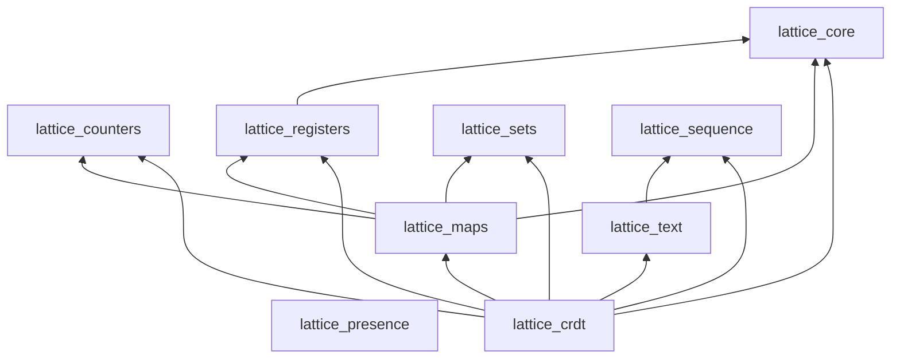

lattice is organized as a family of focused packages. Each package covers one
category of CRDTs. You can depend on the umbrella `lattice_crdt` for everything,
or pick individual packages for minimal dependencies.

## Packages

| Package | Version | Docs | What it provides |
|---|---|---|---|
| `lattice_crdt` | [](https://hex.pm/packages/lattice_crdt) | [](https://hexdocs.pm/lattice_crdt/) | Umbrella for the core CRDT packages |
| `lattice_core` | [](https://hex.pm/packages/lattice_core) | [](https://hexdocs.pm/lattice_core/) | `ReplicaId`, `VersionVector`, `DotContext` — shared causal infrastructure |
| `lattice_counters` | [](https://hex.pm/packages/lattice_counters) | [](https://hexdocs.pm/lattice_counters/) | `GCounter`, `PNCounter` |
| `lattice_registers` | [](https://hex.pm/packages/lattice_registers) | [](https://hexdocs.pm/lattice_registers/) | `LWWRegister`, `MVRegister` |
| `lattice_sets` | [](https://hex.pm/packages/lattice_sets) | [](https://hexdocs.pm/lattice_sets/) | `GSet`, `TwoPSet`, `ORSet` |
| `lattice_maps` | [](https://hex.pm/packages/lattice_maps) | [](https://hexdocs.pm/lattice_maps/) | `LWWMap`, `ORMap`, `Crdt` dispatch |
| `lattice_sequence` | [](https://hex.pm/packages/lattice_sequence) | [](https://hexdocs.pm/lattice_sequence/) | Generic ordered-list CRDT with move support |
| `lattice_text` | [](https://hex.pm/packages/lattice_text) | [](https://hexdocs.pm/lattice_text/) | Plain-text CRDT backed by `lattice_sequence` |
| `lattice_presence` | [](https://hex.pm/packages/lattice_presence) | [](https://hexdocs.pm/lattice_presence/) | Distributed presence CRDT with topic/key/pid/meta tracking |

## Dependencies



`lattice_counters`, `lattice_sets`, and `lattice_presence` have no lattice
dependencies beyond `gleam_stdlib` and `gleam_json`, making them the lightest
packages to depend on.

## Import paths

In Gleam, imports come from the package name. Even when you install the umbrella
`lattice_crdt`, you import from the sub-package names:

```gleam
import lattice_core/replica_id
import lattice_counters/g_counter
import lattice_sets/or_set
import lattice_maps/or_map
import lattice_sequence/sequence
import lattice_text/text
import lattice_presence/presence_state
```

## Which approach to choose

**Start with `lattice_crdt`** if you are getting started, prototyping, or using
CRDTs from multiple categories. One dependency gives you the core CRDTs.

**Pick individual packages** when binary size or dependency count matters, or
when you only need one category of CRDT. For example, if you only need counters:

```sh
gleam add lattice_counters
```

Add `lattice_presence` separately when you need distributed presence tracking;
it is intentionally independent of the `lattice_crdt` umbrella package.

See [Installation](/installation/) for full details.
