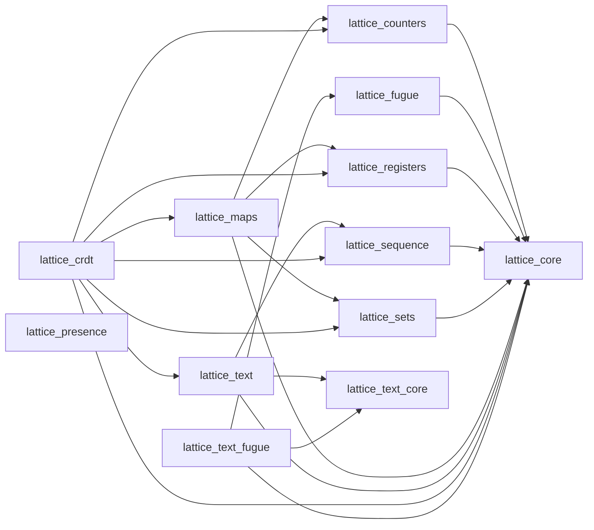

import PackageCatalog from "../../components/PackageCatalog.astro";

lattice is organized as a family of focused packages for CRDTs and their shared
infrastructure. You can depend on the `lattice_crdt` umbrella for the core
toolkit, or pick individual packages for a smaller dependency graph.

## Packages

<PackageCatalog />

## Dependencies



The only packages with no lattice package dependencies are `lattice_core`,
`lattice_text_core`, and `lattice_presence`. `lattice_text_core` depends only on
`gleam_stdlib`; `lattice_core` and `lattice_presence` also depend on
`gleam_json`.

## Import paths

In Gleam, imports come from the package name. Even when you install the umbrella
`lattice_crdt`, you import from the sub-package names:

```gleam
import lattice_core/replica_id
import lattice_counters/g_counter
import lattice_sets/or_set
import lattice_maps/or_map
import lattice_sequence/sequence
import lattice_fugue/sequence
import lattice_text/text
import lattice_text_core/grapheme
import lattice_text_fugue/text
import lattice_presence/presence_state
```

## Which approach to choose

**Start with `lattice_crdt`** if you are getting started, prototyping, or using
CRDTs from multiple categories. It includes the causal core, counters,
registers, sets, maps, the YATA-style sequence, and its text wrapper.

**Pick individual packages** when binary size or dependency count matters, or
when you only need one category of CRDT. For example, if you only need counters:

```sh
gleam add lattice_counters
```

Add `lattice_presence` separately when you need distributed presence. It has no
lattice package dependencies and is not included in the `lattice_crdt` umbrella.

### Evaluating the Fugue packages

`lattice_fugue` and `lattice_text_fugue` are not published to Hex yet. To
evaluate either package, clone the lattice repository and declare the package as
a local path dependency in your project's `gleam.toml`:

```toml
[dependencies]
lattice_fugue = { path = "../lattice/packages/lattice_fugue" }
lattice_text_fugue = { path = "../lattice/packages/lattice_text_fugue" }
```

Keep only the dependency or dependencies you need. Paths are relative to your
project's `gleam.toml`, so adjust them for the location of your lattice clone.
Do not use `gleam add` for these unreleased packages.

See [Installation](/installation/) for full details.
